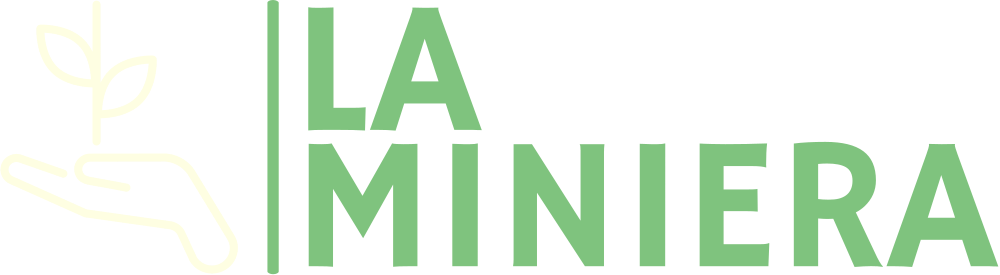

# Benvenuti su La Miniera 🌱
[La Miniera](https://www.laminiera.com) è una piattaforma ecologica con sede a Canzo, in provincia di Como. Siamo dedicati a promuovere uno stile di vita sostenibile e a fornire risorse e informazioni su come ridurre l'impatto ambientale.

## Le nostre iniziative 🌍

- **Raccolta differenziata**: La Miniera promuove la raccolta differenziata dei rifiuti e offre informazioni sulle modalità di smaltimento corrette per ridurre l'impatto ambientale.
- **Mobilità sostenibile**: Promuoviamo l'uso di mezzi di trasporto ecologici come biciclette e mezzi pubblici a basso impatto ambientale.
- **Energia sostenibile**: Offriamo informazioni su come ridurre i consumi energetici e promuoviamo l'uso di fonti energetiche rinnovabili come l'energia solare.
- **Agricoltura sostenibile**: La Miniera promuove l'agricoltura sostenibile e offre informazioni sulle tecniche di coltivazione a basso impatto ambientale.

## Scopri di più 🌿

Visita il nostro sito web [La Miniera](https://www.laminiera.com) per scoprire di più sulle nostre iniziative e su come puoi fare la differenza per un futuro più sostenibile.

 
📱 +39 1234567890

## Orari di apertura 💡

|   Giorno   |           Orario            |
|:----------:|:---------------------------:|
|  Martedì   |        13.30 - 16.30        |
| Mercoledì  |        9.00 - 12.00         |
|  Giovedì   |        13.30 - 16.30        |
|   Sabato   | 9.00 - 12.00, 13.30 - 16.30 |
